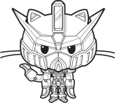

<!-- This README was inspired and created with help of:
* https://github.com/othneildrew/Best-README-Template/
* 
* But, this README has some design differences and other
* ideas of ressembling them, so, for true contribution to
* coding community, visit the origin author.  
 -->

<!-- PROJECT'S SHIELDS -->
<!-- Words from best README author:
* I'm using markdown reference-style hyperlinks for better readability.
* Reference hyperlinks are enclosed in brackets instead of parentheses,
* see the bottom of this document for the declaration of the reference variables
* for entire shields, links and other:
* 
* https://www.markdownguide.org/basic-syntax/#reference-style-links/
 -->

[![Contributors][Contributors-SHIELD]][Contributors-URL]
[![Forks][Forks-SHIELD]][Forks-URL]
[![Stargazers][Stargazers-SHIELD]][Stargazers-URL]
[![Issues][Issues-SHIELD]][Issues-URL]
[![License][License-SHIELD]][License-URL]
[![Commits][Commits-SHIELD]][Commits-URL]

<!-- PROJECT'S LOGO -->
<!--
* Treat this block of README as header or the first thing that user
* reads about your project, so it needs to be unlike others, bright
* and elegant.
* Also in this header you need to show any required links to project's
* documentation, issues hyperlink and other currencies.
 -->
 

    <a href="https://github.com/OctokittyPROJECT/">
        
    <a/>
    <!-- Code breakline -->
    <h3 align="center">Octokitty</h3>
    <!-- Code breakline -->
    

        Way to «githubize» your messenger!
         
        <a href="https://github.com/OctokittyPROJECT/Octokitty-DISCORD/wiki/"><strong>«Explore the docs»</strong></a>
         
         
        <a href="https://github.com/othneildrew/Best-README-Template/tags/">View tags</a>
        /
        <a href="https://github.com/othneildrew/Best-README-Template/issues">Bug report</a>
        /
        <a href="https://github.com/othneildrew/Best-README-Template/issues">Feature request</a>
    

<!-- ABOUT THE PROJECT. -->
<!--
* So here, you need to introduce your project, like in case if you
* want to describe it to someone in hurry-fast situtation. 
 -->

About the project
-----------------

Have you ever wondered if you could move the advanced search engine from this beautiful website to your favourite messenger? If the answer is positive, this bot is gotcha you in this situation!

Discord is very advanced and big, its not even a messenger in this days, more like social network with big-big coding communities, and so this bot is mainly created for those type of communities.

This project wants to add some «spicy» with its search engine through advanced either easy-to-understand commands: search any repo, user, organization or even commit while you talking with someone!

### Built-with

Octokitty was built with help of different libraries and technologies, so there are them:

<!-- There is a website, which contains icons for shields: 
* https://simpleicons.org/ 
* 
* Every icon is in SVG format, but on website there are only-white, when shields got 
* them colorized, if you want to decolozire your icon, use param of logo's color (read shield's docs).
 -->
 
[![DOTNET][DOTNET-SHIELD]][DOTNET-URL] \
[![VISUAL-STUDIO][VISUAL-STUDIO-SHIELD]][VISUAL-STUDIO-URL]

<a href="#readme-top" title="Back to the top of README">[^]</a>

<!-- GETTING STARTED -->
<!-- 
* Describe here how to start and debug your project locally, we are talking here how to
* setup your project for a dev environment stuff: any prerequisites for project, instructions,
* add-on guidelines.
 -->

Getting started
---------------

Project may seem a little-one fella, but it contains a lot of underwater stones, so read this chapter for avoiding some future problems and dilemmas.

### Prerequisites

Before downloading the source code or using this project ensure you met the following requirements:

- Installed [.NET distributive package](https://dotnet.microsoft.com/en-us/download/) on your desktop on which you will edit/setup this project;
- Any text editor or IDE which supports debugging C# code (or plugins to);

### Installations

Octokitty doesn't have any published package-like code, but instead, has tags whose contain compiled versions of the bot for simple-to-use setup and other.

Guideline for installation of source code of the project:

1. Clone the repository with any form of app which supports git (or CLI of this site) - [guide](https://www.howtogeek.com/451360/how-to-clone-a-github-repository/) is attached;
2. Put this application in your path of project and define its namespace if required;
3. Project is ready to be used, debugged or edited in your IDE either text editor;

Installation of compiled sources through tags:

- You can use the direct link to download latest version tag with compiled sources: [download tag](https://api.github.com/repos/OctokittyPROJECT/Octokitty-DISCORD/zipball/latest/);
- If you want more specific, visit specified page of this repository, which contains every tag in git's history;

<a href="#readme-top" title="Back to the top of README">[^]</a>

<!-- PROJECT'S USAGE -->
<!-- Comments from the author:
* Write here, an example, where your bot can be used: can add screenshots, codes, demos or links to other
* resources: just scream, how and when reader can use this project.
 -->

Usage
-----

Main goal of this bot and same its most function is transporting Github's advanced search engine into your messenger: use command, type parameters and get the result - everything is simple.

For example, this bot can used for:

1. Repositories, users, issues, organizations searching by nicknames and their names (in case of issues, by number and other);
2. Different ways of search engine: you can simply search through one repository or through entire site's database;
3. For perfect instance - find commits by changed file name, type and amount of additions/deletions and etc;

<a href="#readme-top" title="Back to the top of README">[^]</a>

<!-- PROJECT'S ROADMAP -->
<!-- 
* Write a long-time roadmap for this project: my direct
* recommendations to not often edit roadmap excluding progress of tasks.
 -->

Roadmap
-------

- [x] Design and write a README;
- [ ] Design the repository: issues, attributes and other;
- [ ] Write the primitive core code of the bot;
- [ ] Write an advanced infrastructure for it;
- [ ] Write an entire [REST](https://octokitnet.readthedocs.io/en/latest/) functional for the project: search commands, getters and other;
- [ ] Design a changelog and write it in;
- [ ] Write the docs.

<a href="#readme-top" title="Back to the top of README">[^]</a>

<!-- PROJECT'S CONTRIBUTING -->
<!-- Contributors, contributing guidelines and other:
* Here you can type random contributors or simply write a contributing
* guideline/reference a contributing policy here.
*
* Github is an open source community, so I highly recommend you to setup
* this block of your project.
 -->

Contributing
------------

Contributions are what make open source community such an interest place to be in - so any form of contribution are greatly appreciated.

If you think that you can help this project become better but think its not so important/realizable in the current situtation or for a full contribution, use issues block, otherwise there is a guideline and policy for contributing.

If you have a suggestion that will improve this project: fork the repository and create a pull request:

1. Fork the repository;
2. Clone the repository with help of any git's client;
3. Make your changes;
4. Stage made changes and push them - [step-by-step guide](https://dev.to/mrfrontend/git-101--step-2-add-stage-commit--push-3p3p) is attached;
5. Create a pull request;
6. Squash commits for cleaner history;

For one-single file contributioning, use a more quicker way without forking the repository through website;

More about it in this article: in [official docs](https://docs.github.com/en/pull-requests/collaborating-with-pull-requests/working-with-forks/syncing-a-fork/) about syncing one-file fork.

<a href="#readme-top" title="Back to the top of README">[^]</a>

<!-- LICENSE -->

License
-------

Project is being distributed under the [MIT License](https://choosealicense.com/licenses/mit/): see the file for more specified information.

This README was inspired by this - [best README template](https://github.com/othneildrew/Best-README-Template/).

<a href="#readme-top" title="Back to the top of README">[^]</a>

<!-- CONTACT -->

Contact
-------

Contact information for maintain developer can be acquired on his profile, in other cases, use issues or email.

<!-- Using "MAILTO" for better view of README -->

- <a href="mailto: io.falcion@outlook.com">Outlook E-mail</a>

If developer didn't answer, please, reach him out through this repository/website directly.

<a href="#readme-top" title="Back to the top of README">[^]</a>

<!-- ACKNOWLEDGEMENTS -->

Acknowledgements
----------------

- [.NET](https://dotnet.microsoft.com/en-us/)
- [Octokit.net](https://octokitnet.readthedocs.io/en/latest/)
- [README pattern](https://github.com/othneildrew/Best-README-Template/)
- [.GITIGNORE pattern](https://github.com/github/gitignore/)
- [.GITATTRIBUTES pattern](https://github.com/alexkaratarakis/gitattributes/)

<a href="#readme-top" title="Back to the top of README">[^]</a>

<!-- MARKDOWN HYPERLINKS AND IMAGES -->
<!-- 
 -->

[Contributors-SHIELD]: https://img.shields.io/github/contributors/OctokittyPROJECT/Octokitty-DISCORD?style=for-the-badge
[Contributors-URL]: https://github.com/OctokittyPROJECT/Octokitty-DISCORD/graphs/contributors/
[Forks-SHIELD]: https://img.shields.io/github/forks/OctokittyPROJECT/Octokitty-DISCORD?style=for-the-badge
[Forks-URL]: https://github.com/OctokittyPROJECT/Octokitty-DISCORD/network/members/
[Stargazers-SHIELD]: https://img.shields.io/github/stars/OctokittyPROJECT/Octokitty-DISCORD?style=for-the-badge
[Stargazers-URL]: https://github.com/OctokittyPROJECT/Octokitty-DISCORD/stargazers/
[Issues-SHIELD]: https://img.shields.io/github/issues/OctokittyPROJECT/Octokitty-DISCORD?style=for-the-badge
[Issues-URL]: https://github.com/OctokittyPROJECT/Octokitty-DISCORD/issues/
[License-SHIELD]: https://img.shields.io/github/license/OctokittyPROJECT/Octokitty-DISCORD?style=for-the-badge
[License-URL]: https://github.com/othneildrew/Best-README-Template/blob/default/LICENSE.md/
[Commits-SHIELD]: https://img.shields.io/github/last-commit/OctokittyPROJECT/Octokitty-DISCORD?style=for-the-badge
[Commits-URL]: https://github.com/OctokittyPROJECT/Octokitty-DISCORD/commits/
[DOTNET-SHIELD]: https://img.shields.io/badge/-dotnet-512BD4?style=for-the-badge&logo=dotnet&logoColor=white/
[DOTNET-URL]: https://dotnet.microsoft.com/en-us/
[VISUAL-STUDIO-SHIELD]: https://img.shields.io/badge/-visual%20studio-5C2D91?style=for-the-badge&logo=visualstudio&logoColor=white/
[VISUAL-STUDIO-URL]: https://visualstudio.microsoft.com/